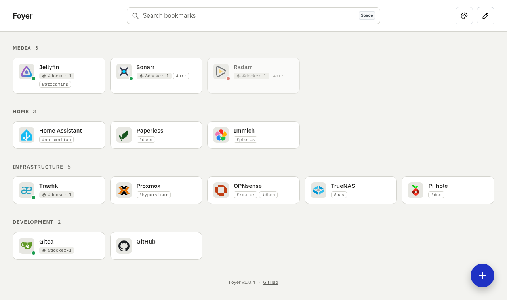

# Foyer

A self-hosted bookmark dashboard that replaces gethomepage.dev. Bookmarks live in
ordered categories and come from two sources: Docker containers labeled
`coxdev.bookmark.*` (or the existing `homepage.*` labels) across several hosts, and
bookmarks added by hand.

One container: a .NET 10 minimal API that also serves the React app.

<picture>
  <source media="(prefers-color-scheme: dark)" srcset="docs/screenshots/main-dark.png">
  
</picture>

## Layout

| Path | What |
| --- | --- |
| `src/Foyer.Api` | Host: endpoints, SSE, static files |
| `src/Foyer.Core` | Domain, sync rules, data, Docker; no ASP.NET dependency |
| `tests/` | xUnit v3 + Shouldly |
| `web/` | React + Vite + TypeScript + Mantine |
| `docs/` | Spec, project layout plan and wireframes |
| `.github/workflows` | CI (Gitea Actions and GitHub Actions) |

## Local dev

Requires the .NET 10 SDK and Node 22.

```bash
docker compose -f dev/compose.dev.yml up -d   # socket proxy on :2375 + labeled test containers
```

```bash
dotnet watch --project src/Foyer.Api     # API on :5080, syncing the "dev" host
```

```bash
cd web && npm install && npm run dev     # UI on :5173, proxies /api to :5080
```

Checks, as CI runs them:

```bash
dotnet format Foyer.slnx --verify-no-changes && dotnet build Foyer.slnx && dotnet test
```

```bash
cd web && npm run lint && npm run format:check && npm run typecheck && npm test && npm run build
```

Integration tests (`Category=Integration`) start socket proxies and containers with
Testcontainers, so they need a local Docker socket. They run in CI as-is. To skip them:

```bash
dotnet test -- --filter-not-trait "Category=Integration"
```

With rootless podman instead of Docker, point Testcontainers and compose at the podman socket:

```bash
export DOCKER_HOST=unix:///run/user/$UID/podman/podman.sock DOCKER_SOCKET=/run/user/$UID/podman/podman.sock TESTCONTAINERS_RYUK_DISABLED=true
```

Podman's Docker-compatible API leaves health out of container listings, so health dots only
show against real Docker.

Regenerate API types (API must be running): `cd web && npm run gen:api`.

Migrations live in `src/Foyer.Core/Data/Migrations` and are applied at startup. In dev the
database goes to `./data` (gitignored). To add one:

```bash
dotnet tool restore && dotnet ef migrations add <Name> -p src/Foyer.Core -o Data/Migrations
```

## Image

Released images are at `ghcr.io/cameroncox/foyer` (`:latest`, `:X.Y.Z`, and `:dev` for develop
builds):

```bash
mkdir -p data
docker run -p 8080:8080 --user "$(id -u):$(id -g)" -v "$PWD/data:/data" ghcr.io/cameroncox/foyer:latest
```

To build it yourself instead, `docker build -t foyer .` and run `foyer`.

The runtime image is chiseled and non-root (uid 1654 unless `--user` / compose `user:` overrides
it; `./data` must be writable by that user). Its healthcheck runs
`dotnet Foyer.Api.dll --healthcheck`, which probes `/healthz`.

## Releases

The `release` job in `.github/workflows/ci.yml` runs after every check job passes and pushes
images to `<REGISTRY>/<owner>/<repo>`, where `REGISTRY` is an Actions repo variable holding the
registry's host, such as your Gitea instance or `ghcr.io`:

| Trigger | Tags |
| --- | --- |
| Tag `vX.Y.Z` | `:X.Y.Z`, `:latest` |
| Push to `develop` | `:dev`, `:<7-char sha>` |

It logs in as the `REGISTRY_USERNAME` variable with the `REGISTRY_TOKEN` secret, an access token
that can write packages for the image's owner. On GitHub both can be left unset, and the run's
own token pushes to `ghcr.io`. The image logs its version at startup.

## Deploy

The quickest start runs Foyer on its own, as a bookmark manager on port 8080:

```bash
mkdir -p deploy/data && FOYER_UID=$(id -u) FOYER_GID=$(id -g) docker compose -f deploy/compose.example.yml up -d
```

Then open http://localhost:8080. The examples in `deploy/` (fill in any `[BRACKETED]` values
first):

| File | Runs |
| --- | --- |
| `compose.example.yml` | Foyer alone, as a bookmark manager with no Docker hosts, on port 8080 (Traefik labels included, commented out) |
| `compose.docker.example.yml` | Foyer behind Traefik, reading its own host's containers through a private, unpublished socket proxy |
| `socket-proxy.example.yml` | A read-only proxy for another host Foyer reads; firewall its port to Foyer's host (see the file: ufw doesn't filter Docker's published ports) |

## Bookmarklet

In edit mode, the Categories drawer has an **Add to Foyer** link. Drag it to the browser's
bookmarks bar; clicking it on any page opens a small popup with the Add form filled in from
that page's URL and title, and closes it once saved. Pick a category above the link to have the
form start there; each category can have its own link. The link points at the address Foyer was
opened on, so drag it from the address you'll use day to day. It isn't offered on phones, where
bookmarklets don't see the page they're run from.

## Profiles

A profile is a named view of Foyer with its own bookmarks, categories and order, at
`/{name}`. **Default** is the home profile and the only one that holds Docker bookmarks;
upgrading from 1.0 moves everything into it. Pick or create profiles from the menu beside the
title (at the top of the menu on a phone); `/` reopens the one last picked on that device.

- **Without an auth proxy**, everyone sees Default and every profile made there, and can edit
  them all.
- **Behind one** (Tinyauth, or anything that sends `Remote-User`), each user also gets a
  personal profile, made the first time they visit, and can make more that only they see.
  Default is read-only for them unless they're listed in `FOYER_DEFAULT_REMOTE_USERS` or
  `FOYER_DEFAULT_REMOTE_GROUPS`. Set `FOYER_TRUSTED_PROXIES` to the proxy's address once Foyer
  can be reached any other way, or anyone can claim to be any user.
- **Shared bookmarks** show in every profile, read-only, in a category of the same name. Share
  one with the Shared switch in its Add or Edit form; Docker bookmarks can be shared from Default.

`FOYER_PROFILES=false` turns all of this off: every request uses Default, as in 1.0. Other
profiles, and the bookmarks they share, are hidden until it's turned back on. See the
[1.1 spec](docs/spec-1.1.md) for the details.

## Configuration

Environment variables only. See the [spec](docs/spec.md) and the [1.1 spec](docs/spec-1.1.md)
for the full list; the essentials:

Docker hosts are optional: with no `FOYER_DOCKERHOSTS_{KEY}_URI` set, Foyer runs as a plain
bookmark manager with manually added bookmarks only.

| Variable | Default | Purpose |
| --- | --- | --- |
| `FOYER_DOCKERHOSTS_{KEY}_URI` | — | Docker endpoint per host (`unix://`, `tcp://`, `http://`) |
| `FOYER_DOCKERHOSTS_{KEY}_NAME` | `KEY` lowercased | Display name and host tag |
| `FOYER_HOMEPAGE_LABELS` | `true` | Fall back to `homepage.*` labels |
| `FOYER_RESYNC_INTERVAL` | `300` | Seconds between full resyncs |
| `FOYER_POLL_INTERVAL` | `30` | Poll interval when a host's event stream is down |
| `FOYER_PRUNE_AFTER_DAYS` | `30` | Days a removed container's hidden bookmark is kept before it's deleted (`0` = forever) |
| `FOYER_DATA_DIR` | `/data` | SQLite file and icon cache |
| `FOYER_TITLE` | `Foyer` | Name in the top bar and the browser tab (up to 60 characters) |
| `FOYER_SEARCH_URL` | `https://duckduckgo.com/?q=` | The spotlight's web search; the query replaces `%s`, or is appended. Bangs (`!g …`) go straight to DuckDuckGo |
| `FOYER_PROFILES` | `true` | `false` turns profiles off; every request uses Default, as in 1.0 |
| `FOYER_PROFILE_HEADER` | `Remote-User` | Header the auth proxy names the user in |
| `FOYER_GROUPS_HEADER` | `Remote-Groups` | Header listing the user's groups, comma-separated |
| `FOYER_TRUSTED_PROXIES` | empty (any address) | IPs or CIDRs allowed to send those headers, comma-separated; others get a 403 |
| `FOYER_DEFAULT_REMOTE_USERS` | empty | Users who can edit Default, comma-separated. `@` and `_` match each other, since Tinyauth sends `me@example.com` as `me_example.com` |
| `FOYER_DEFAULT_REMOTE_GROUPS` | empty | Groups whose members can edit Default, comma-separated |

With no Default editors listed, only requests without a user header can edit Default.

## Built with AI

Foyer was made with the help of AI. The spec, project layout plan and wireframes in `docs/` were
drafted with Claude (Anthropic), and much of the code was written with Claude Code, working from
those documents alongside the maintainer.

## License

[MIT](LICENSE)
